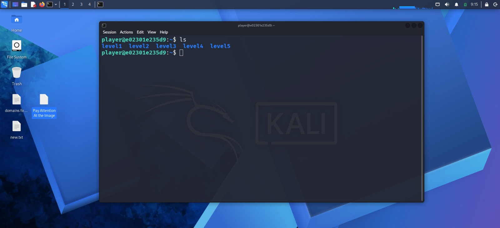
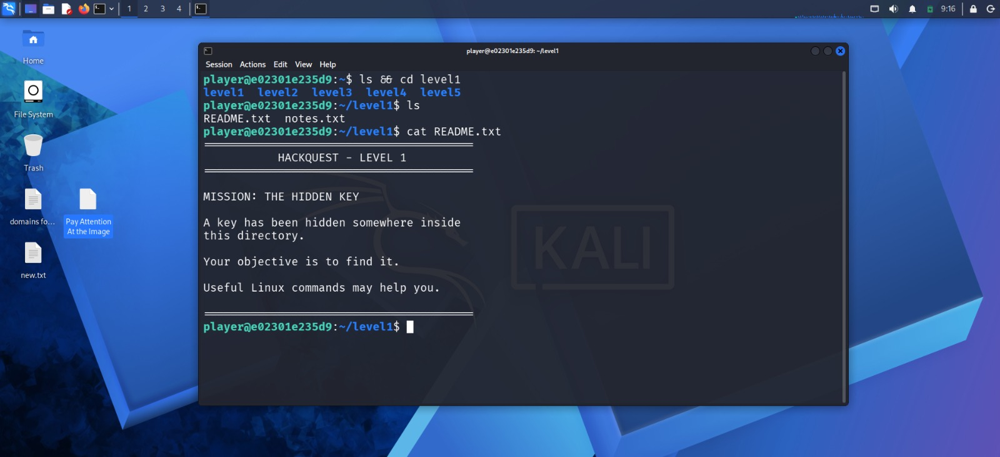

# 🛡️ HackQuest

> **A 5-Level SSH-Based Cybersecurity Wargame**

Learn Linux and cybersecurity fundamentals through hands-on terminal challenges.

**Created by Atharva A. Deshmukh**

Creator and developer of **HackQuest**.

GitHub: https://github.com/rydencrexo-stack

## 🎯 About

HackQuest is an educational cybersecurity wargame inspired by
terminal-based security challenges.

Players connect through SSH and solve progressively challenging
Linux-based missions.

## 🧩 Levels

1. **The Hidden Key** — Hidden files
2. **The Search** — Recursive searching
3. **The Encoded Message** — Base64 decoding
4. **The Mystery File** — File identification and strings
5. **The Final Vault** — Multi-step investigation

## 🛠️ Built With

- Linux
- Bash
- Docker
- Docker Compose
- OpenSSH

## 🖥️ Screenshots

Explore the HackQuest terminal-based cybersecurity experience through these previews.

### 🔐 HackQuest Gameplay

### 🕵️ Level 1 — The Hidden Key

## ⚠️ Disclaimer

HackQuest is designed for educational and authorized cybersecurity
practice only.

Do not use the techniques learned here against systems without
permission.

## 📄 Copyright

Copyright © 2026 **Atharva A. Deshmukh**

HackQuest was created and developed by Atharva A. Deshmukh.
=======
# HackQuest
A 5-level SSH-based cybersecurity wargame for learning Linux commands, file investigation, encoding, and basic security concepts.

